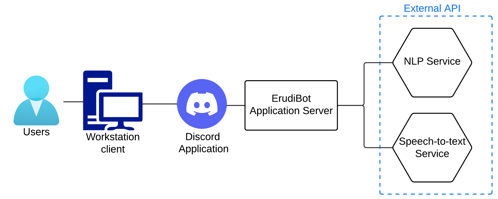
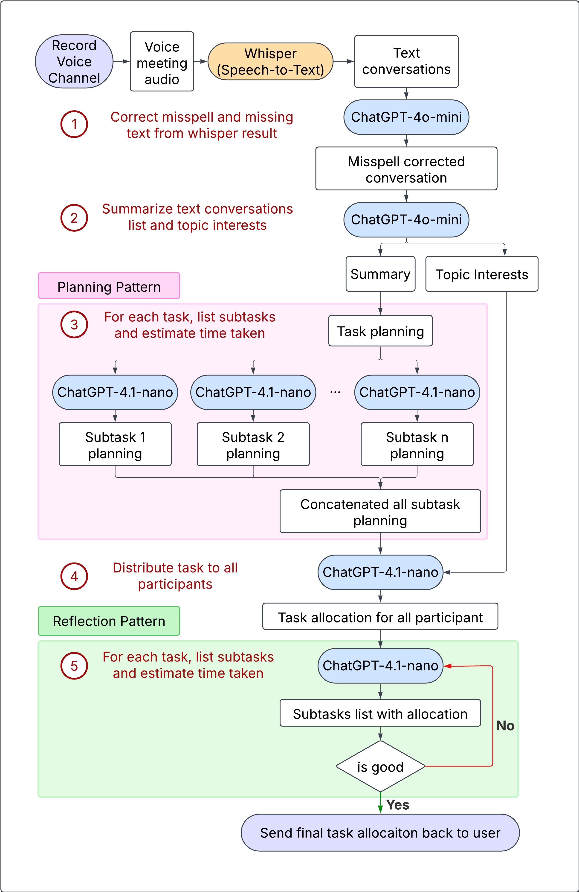

# ErudiBot Application Server

ErudiBot is a smart assistant for your Discord meetings. It enhances collaboration by automatically recording, transcribing, summarizing, and assigning tasks based on voice conversations.

This repository contains the application server for ErudiBot. It connects to external APIs such as OpenAI's Whisper (for speech-to-text) and ChatGPT (for summarization and intelligent responses).
We have also integrated the Planning and Reflection patterns from the concept of Agentic AI Design Patterns to improve ErudiBot's performance and response quality.

Below are images of the system architecture and prompt flow.





## Table of Contents

- [Features](#features)
- [Prerequisites](#prerequisites)
- [Setup](#setup)
- [Usage](#usage)

## Features

### 🎙️ Meeting Recording & Transcription
- /record – Starts recording the meeting. (Must be in a voice channel)

- /stop – Stops the recording, transcribes the audio, and generates a summary in the current text channel.

### 💫 Smart Message Interactions (Apps)
- Ask GPT – Right-click any message → Apps → Ask GPT
→ Ask follow-up questions or dive deeper based on that message.

- Get Task Allocation – Right-click on the meeting summary → Apps → Get Task Allocation
→ Automatically assigns action items to participants based on the summary.


## Prerequisites

Before you begin, ensure you have met the following requirements:

- Node.js
- Openai API
- A Discord account
- [Discord Developer Portal](https://discord.com/developers/applications) access to create a bot token

## Setup

Follow these steps to set up your development environment:

1. **Clone the repository**:
   ```bash
   git init
   git clone https://github.com/Nathathaii/ErudiBot-app-server.git
   cd ErudiBot-App-Server
   ```

2. **Set up**:
   ```bash
   npm init
   npm install
   ```

3. **Create .env file**:
   State variables in .env file


4. **Register discord bot commands**:
   ```bash
   node register-commands_global.js
   ```

## Usage
To run your bot locally, use the following command:
   ```bash
   nodemon
   ```

You can see what ErudiBot can do by using the /help command in Discord.
